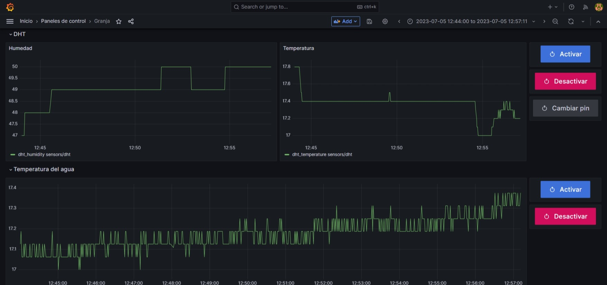
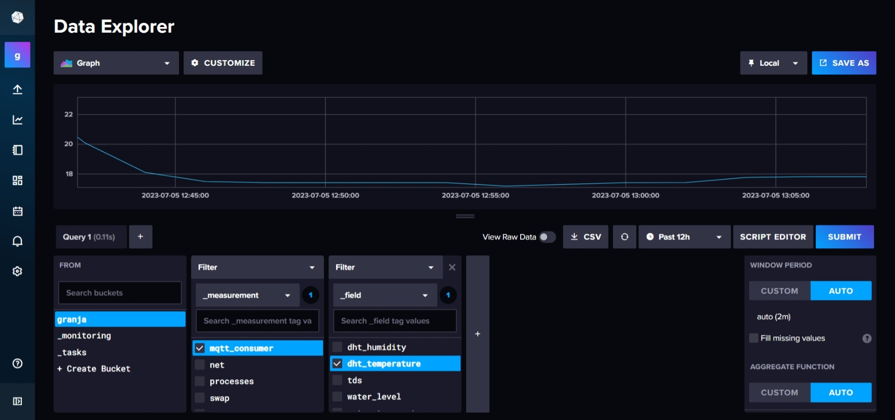

# Granja-docker (local server)

## Description

This project called Granja-Docker is an application that automates a hydroponic farm using Docker container technologies. The hydroponic farm is a system in which water constantly flows, providing the necessary nutrients for plant growth.

The main objective of this project is to monitor and control various aspects of the hydroponic farm, such as temperature, water turbidity, water level, and data related to plant production. To achieve this, Docker images and services are used, running on a local server such as a Raspberry Pi 4 with Ubuntu.

## Installation

To install the Granja-Docker application on a local server, follow these steps:

Download the application source code by running the following command in Linux:

1. Download the application source code by running the following command in Linux:

```bash
wget https://github.com/seba-m/granja-docker
tar -xf granja-docker.tar.gz
cd granja-docker
```

2. Grant execution permissions to the `install.bash` file with the following command:

```bash
chmod +x ./install.bash
```

3. Run the installation script with superuser privileges:

```bash
sudo ./install.bash
```

## Execution
Once the application is installed, you can run it using the following commands:

1. Grant execution permissions to the `start.bash` file with the following command:

```bash
chmod +x ./start.bash
```

2. Start the application by running the following command:

```bash
sudo ./start.bash
``` 

## Stopping the application
If you want to stop the application, use the following commands:

1. Grant execution permissions to the `stop.bash` file with the following command:

```bash
chmod +x ./stop.bash
```

2. Stop the application by running the following command:

```bash
sudo ./stop.bash
```

## Usage
Once the application is running, you can access the Grafana interface by entering the following URL in your browser:

```bash
http://localhost/grafana
```

The default username and password are `admin` and `admin`, respectively. Once you have logged in, you can create a new password for your account.

To access the InfluxDB interface, enter the following URL in your browser:

```bash
http://localhost/influx
```

The default username and password are `admin` and `admin12345678`, respectively. Once you have logged in, you can create a new password for your account.

## Configuration
This project asumes that you have a Esp32 with the [following code](https://github.com/seba-m/granja-esp32) already configured, with this server running in the same network.

ps: you can get the current server ip with the following command:
```bash
hostname -I | awk '{print $1}'
```

## Architecture and Services
The Granja-Docker application consists of the following services:

- Mosquitto: It is an MQTT (Message Queuing Telemetry Transport) broker responsible for receiving data from the sensors of the hydroponic farm system and transmitting it to other services.
- InfluxDB: It is a time-series database that stores the data received from the sensors. It allows querying and analyzing historical data.
- Grafana: It is a data visualization tool that allows you to create dashboards to display the data stored in the InfluxDB database.
- Telegraf: It is a data collector that allows you to collect data from the sensors and send it to the InfluxDB database.
- Nginx: It is a web server that allows you to access the Grafana and InfluxDB interfaces through a web browser.

This application has one mode of operation:

- Local Server: Uses a Raspberry Pi 4 or any other compatible device (armv7+ or amd64) as a local server. Sensor data is sent to the Mosquitto MQTT broker, which transmits it to InfluxDB. The data is stored in InfluxDB and can be visualized using Grafana, which provides an interface to observe and set basic rules for the stored data.

Communication between services is done through Docker networks. Using the MQTT protocol, which allows efficient transmission of sensor data. The following diagram shows the architecture of the application:


It is important to note that the Granja-Docker application focuses on controlling and monitoring the aspects that occur within the hydroponic farm box. Sensors located inside the box capture the data and sendit to the system for analysis and control. Rules based on this data can be established to execute actions such as notifications, adjustments, among others. The application does not cover aspects outside the box unless additional sensors are used.

---

With this, you have everything you need to start using the Granja-Docker application on your local server! Remember that this project focuses on providing automation and control for a hydroponic farm using Docker container technologies. Enjoy the experience of monitoring and controlling your own hydroponic farm!

## Panel example


